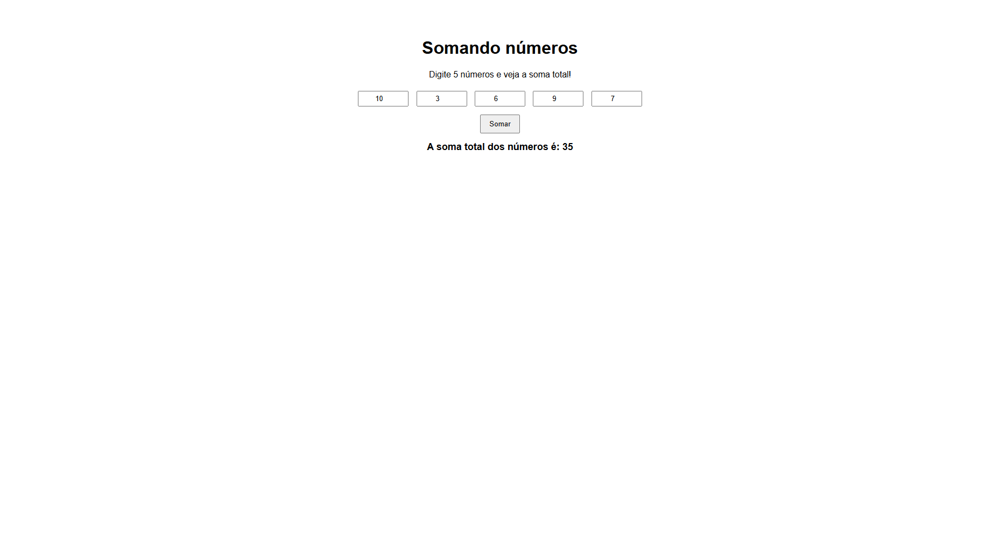

## Lógica de Programação - Exercício 2: Soma de Números

Este é um projeto simples que permite ao usuário digitar 5 números e calcular a soma total.

## Screenshot

Aqui está uma imagem do projeto em funcionamento:

## 🚀 Funcionalidades
- Interface amigável para entrada dos números.
- Validação para garantir que apenas números sejam inseridos.
- Exibição do resultado diretamente na página.

## 🛠️ Tecnologias utilizadas
- **HTML** - Estrutura da página
- **CSS** - Estilização da interface
- **JavaScript** - Lógica do cálculo da soma

Feito com ❤️ por Cláudia Costa Paniago

